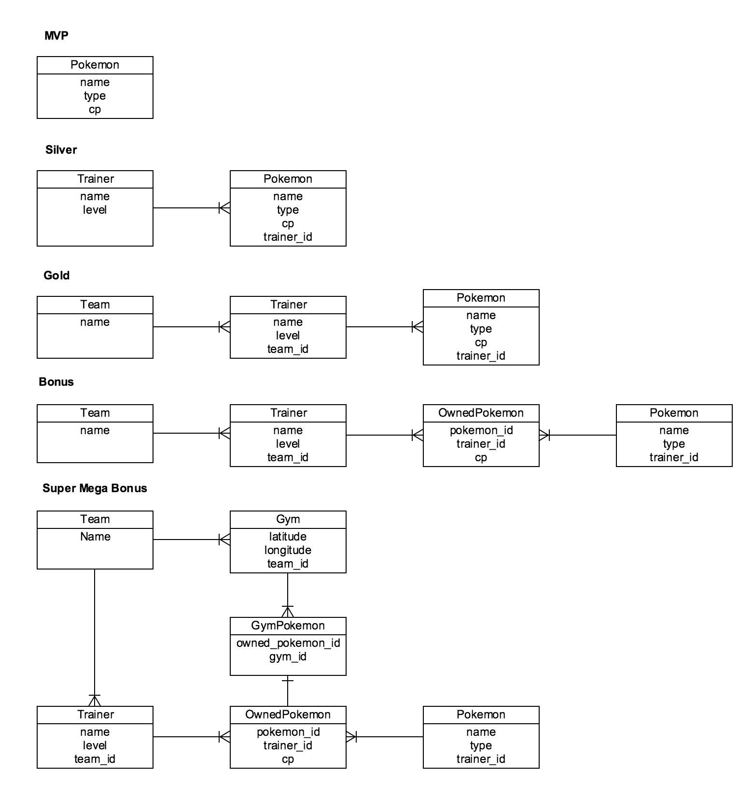

# Pokenatra

## Objectives

Build at least a single model application using Sinatra that allows for the creating, reading, updating and deleting of Pokemon.

Listed below are the various potential ERD's for this app in increasing difficulty. **Do not attempt to code an ERD unless you have already finished coding the domains before it** (i.e., "I can only do silver if I've finished the MVP"). Remember, a polished MVP is better than a non functioning silver.

> WARNING: type is a reserved word in Active Record, make sure that you never a column name type in Active Record.

## Deliverables

- Fully functional CRUD on a Pokemon model (i.e., you can read, create, update and delete a Pokemon).

## Recommendations

- Build a seed file so that you have data you can test your UI against.
- If you need help coming up with values for your Pokemon attributes, find inspiration in `sample_data.rb`.
- Be able to CRUD a Pokemon in Pry before doing that through Sinatra.
- Build the UI after the previous steps have been completed.

## Resources for Bonus

- [Andy's Blogpost on many-to-many](http://andrewsunglaekim.github.io/many-actives-to-many-records/)
- [Rails many-to-many lesson](https://github.com/ga-wdi-lessons/rails-many-to-many)

> The latter resource is a Rails mini-lesson. It may be difficult to parse through the rails material to get what you need for many-to-many.
